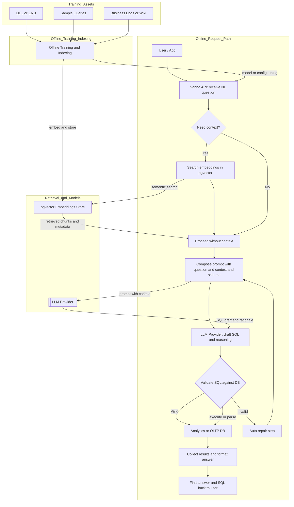
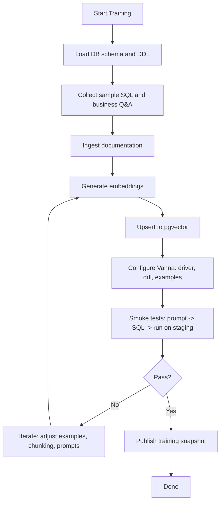
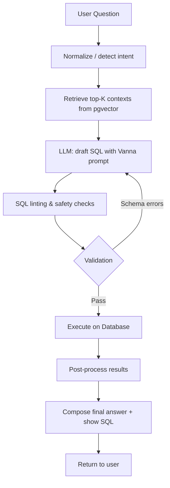

# High Level System

```mermaid
flowchart TD
  %% -------- ONLINE REQUEST PATH (SEQUENTIAL) --------
  subgraph Online_Request_Path
    A[User / App] --> B1[Vanna API: receive NL question]

    B1 --> B2{Need context?}
    B2 -- Yes --> R1[Search embeddings in pgvector]
    R1 --> R2[Return retrieved context to Vanna]
    B2 -- No --> R2[Proceed without context]

    R2 --> P1[Compose prompt with question and context and schema]
    P1 --> LLM[LLM Provider: draft SQL and reasoning]

    LLM --> V1{Validate SQL against DB}
    V1 -- Valid --> DB[Execute SQL on Analytics or OLTP DB]
    DB --> F1[Collect results and format answer]
    F1 --> OUT[Final answer and SQL back to user]

    V1 -- Invalid --> AR[Auto repair step]
    AR --> P1
  end

  %% -------- RETRIEVAL & MODELS --------
  subgraph Retrieval_and_Models
    V[pgvector Embeddings Store]
    LLM2[[LLM Provider]]
  end

  %% Wire Online path to actual components
  R1 -->|semantic search| V
  V -->|retrieved chunks and metadata| R2
  P1 -->|prompt with context| LLM2
  LLM2 -->|SQL draft and rationale| LLM
  V1 -->|execute or parse| DB[Analytics or OLTP DB]

  %% -------- OFFLINE TRAINING / INDEXING --------
  subgraph Training_Assets
    D1[DDL or ERD]
    D2[Sample Queries]
    D3[Business Docs or Wiki]
  end

  subgraph Offline_Training_Indexing
    T[Offline Training and Indexing]
  end

  D1 --> T
  D2 --> T
  D3 --> T
  T -->|embed and store| V
  T -->|model or config tuning| B1


```

# Training

```mermaid
flowchart TD
  A[Start Training] --> B[Load DB schema and DDL]
  B --> C[Collect sample SQL and business Q&A]
  C --> D[Ingest documentation]
  D --> F[Generate embeddings]
  F --> G[Upsert to pgvector]
  G --> H[Configure Vanna: driver, ddl, examples]
  H --> I[Smoke tests: prompt -> SQL -> run on staging]
  I --> J{Pass?}
  J -- No --> K[Iterate: adjust examples, chunking, prompts]
  K --> F
  J -- Yes --> L[Publish training snapshot]
  L --> M[Done]

```

# Indexing 

```mermaid
flowchart TD
  U[User Question] --> A[Normalize / detect intent]
  A --> B[Retrieve top-K contexts from pgvector]
  B --> C[LLM: draft SQL with Vanna prompt]
  C --> D[SQL linting & safety checks]
  D --> E{Validation}
  E -- Schema errors --> C
  E -- Pass --> F[Execute on Database]
  F --> G[Post-process results]
  G --> H[Compose final answer + show SQL]
  H --> I[Return to user]

```